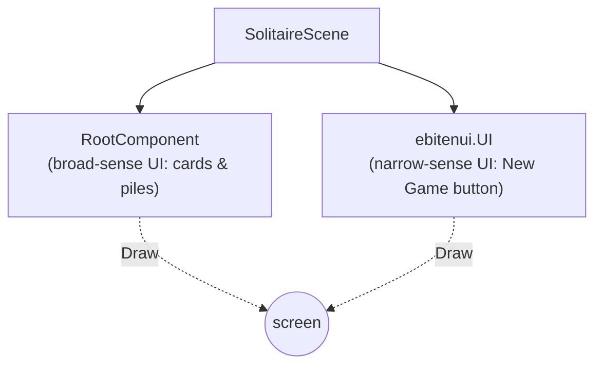
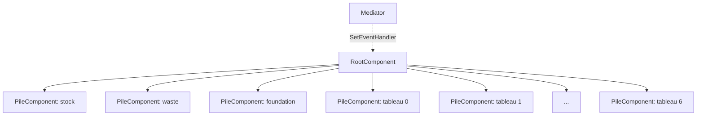
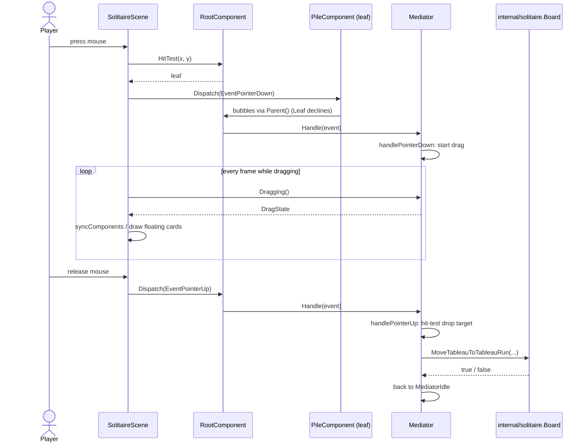

# Architecture

This document explains how `trump-center` is put together, as a record of the design decisions behind it — see the README for what the project is and why it exists. It assumes some familiarity with Go and with Ebitengine's `Update`/`Draw` game loop.

## Two scenes, two different approaches to "UI"

The game currently has two scenes, and they take deliberately different approaches:

- **Title scene** (`internal/game/scenes/title`): a menu screen built entirely with [`ebitenui`](https://github.com/ebitenui/ebitenui), a widget-style UI toolkit (buttons, text, layout containers).
- **Solitaire scene** (`internal/game/scenes/solitaire`): the card board, built with a custom architecture described below, *and* a small amount of `ebitenui` for its one piece of real chrome (the "New Game" button).

This split follows from distinguishing two senses of "UI":

- **Narrow sense**: widget-style chrome — buttons, labels, menus. `ebitenui` is a good fit for this, and the project's policy is to lean on it rather than build custom widgets.
- **Broad sense**: whatever the player directly manipulates on screen. On the solitaire board, that's the cards and piles — not widgets, but the actual content of the game. `ebitenui`'s layout model (containers, rows, anchors) isn't a good fit for freely positioned, draggable game pieces, so the board gets its own architecture instead.

These aren't competing frameworks fighting over the same job. `SolitaireScene` (`internal/game/scenes/solitaire/solitaire.go`) draws its own component tree for the board *and* holds an `*ebitenui.UI` for the "New Game" button, side by side: `Update` calls `s.ui.Update()` for the button and dispatches board input separately; `Draw` calls `s.root.Draw(screen)` for the board and `s.ui.Draw(screen)` for the button. Neither one knows about the other. This is a working example of the two senses of UI coexisting on one scene, not just a claim.



## Game rules vs. the view: two packages

Klondike's rules live in `internal/solitaire`, independent of Ebitengine or any drawing code:

- `Board`, `Pile`, and `card.Card` are plain data.
- `Deal`, `DrawFromStock`, `MoveWasteToFoundation`, `MoveTableauToTableauRun`, `Won`, and friends are plain functions and methods that mutate a `Board` and report success as a `bool`. An illegal move is just `false`, not an error — nothing here talks about pixels, input, or drawing.

`internal/game/scenes/solitaire` is everything else: turning a `Board` into pixels, and turning mouse input back into calls on a `Board`. This package is where the rest of this document lives.

The reason for keeping these separate: `internal/solitaire` can be tested (and was, extensively) without a display, an event loop, or any of Ebitengine — it's just data in, data out.

## The board's architecture

The board follows four patterns together, each solving one part of "how do pixels on screen turn into game moves, without any one piece knowing too much":

1. **Composite** — a tree of drawable components.
1. **Passive View** — components that only hold what they need to draw themselves.
1. **Chain of Responsibility** — input bubbles up the tree looking for a handler.
1. **Mediator** — one object owns every decision.

### Composite: the component tree (`component.go`)

Every visual piece of the board implements `Component`:

```go
type Component interface {
	Draw(screen *ebiten.Image)
	Children() []Component
	Bounds() image.Rectangle
	Parent() Component
	HandleEvent(e Event) bool
}
```

`RootComponent` is the root of the tree; its children are the stock, waste, foundation, and seven tableau piles, each a `PileComponent`. `RootComponent.Draw` just draws its children in order; `RootComponent.HitTest(x, y)` walks them to find which one contains a point. There's no deeper nesting today — every pile is a direct child of `Root` — but the tree shape is what lets hit-testing and event bubbling (below) be written once, generically, instead of per-pile.



### Passive View: `PileComponent`

A `PileComponent` is deliberately dumb. It holds a fixed `bounds` (its clickable/drop area, set once at construction) and a slice of `CardDraw` values — `{Image, X, Y}`, nothing more:

```go
func (p *PileComponent) SetCards(cards []CardDraw) { p.cards = cards }
func (p *PileComponent) Draw(screen *ebiten.Image) {
	for _, c := range p.cards {
		drawCard(screen, c.Image, c.X, c.Y)
	}
}
```

It has no idea what a "pile" means in Klondike terms, doesn't know the rules, and can't make a decision — it only draws whatever it was last told to draw. `SolitaireScene.syncComponents` is the only thing that calls `SetCards`, once per frame, translating the current `*solitaire.Board` into `CardDraw` values (see [`SolitaireScene`: input polling, dispatch, and draw — nothing else](#solitairescene-input-polling-dispatch-and-draw--nothing-else) below). This is the Passive View half of MVP: all state and logic live elsewhere, the view is just a rendering target.

`PileComponent.HandleEvent` always returns `false` — a Passive View has nothing to decide, so it declines every event, which is what makes the next part work.

### Chain of Responsibility: bubbling input (`event.go`)

An `Event` (`{Type, X, Y}`, currently `EventPointerDown`/`EventPointerUp`) is dispatched starting at some component and walks up `Parent()` links until something handles it:

```go
func Dispatch(source Component, e Event) bool {
	for c := source; c != nil; c = c.Parent() {
		if c.HandleEvent(e) {
			return true
		}
	}
	return false
}
```

Every `PileComponent` declines (see above), so every event bubbles straight past them to `RootComponent`, the chain's terminal link. This looks like overkill for a two-level tree, but it means hit-testing and dispatch don't need special-casing per pile type, and it's the seam the Mediator plugs into.

### Mediator: the only thing that decides anything (`mediator.go`)

`RootComponent.HandleEvent` delegates to whatever handler was installed with `SetEventHandler` — that handler is `Mediator.Handle`. `Mediator` is a small state machine (`MediatorIdle` / `MediatorDragging`) that owns:

- Starting a drag on pointer-down: drawing from the stock, or picking up a face-up tableau card (and every card above it, as a run) or the waste's top card.
- Resolving pointer-up: hit-testing the drop target and calling the matching `internal/solitaire.Board` method (`MoveWasteToFoundation`, `MoveTableauToTableauRun`, etc.). If the move is illegal, it records a `RejectedDrop` for that pile, which it keeps reporting for half a second (`Tick`, called once per `Update`) so the board can briefly flag it.
- Answering "where could the current drag legally be dropped right now" (`ValidDropTargets`), using the same `Board.CanMove...` checks the moves themselves use, so the board can highlight those piles while `PileComponent` (which only outlines whatever `Highlight` rectangles and colors `SetHighlights` gives it) still decides nothing.
- Knowing whether the game is stuck (`Stuck`): after every change to the board, it hands a `Board.Clone()` to a goroutine running `Board.Stuck()` (a bounded search that can take up to a second or two, so it must not block the game loop), and `Tick` picks up the result once it's ready. This is the only concurrency on the board; the goroutine only ever touches its own copy, and a result for an outdated board is simply never read.

Nothing else in the package makes a decision like this. `PileComponent` can't (Passive View), `SolitaireScene` doesn't (see below) — it's centralized in one place specifically so that decision logic can be tested against synthetic `Event` values, without a display or real mouse input (see `mediator_internal_test.go`).

### `SolitaireScene`: input polling, dispatch, and draw — nothing else

After all of the above, `SolitaireScene.Update` is short:

```go
func (s *SolitaireScene) Update() (scene.Scene, error) {
	s.ui.Update()
	if s.newGameRequested { ... }
	s.syncComponents()

	x, y := ebiten.CursorPosition()
	if inpututil.IsMouseButtonJustPressed(ebiten.MouseButtonLeft) {
		if hit := s.root.HitTest(x, y); hit != nil {
			Dispatch(hit, Event{Type: EventPointerDown, X: x, Y: y})
		}
	}
	if inpututil.IsMouseButtonJustReleased(ebiten.MouseButtonLeft) {
		Dispatch(s.root, Event{Type: EventPointerUp, X: x, Y: y})
	}
	return nil, nil
}
```

It reads real input, turns it into an `Event`, and hands it off — it has no idea what dragging a card even means. `syncComponents` is the one place that reaches into `*solitaire.Board`, `Mediator.Dragging()`, `Mediator.ValidDropTargets()`, and `Mediator.RejectedDrop()` to compute what each `PileComponent` should currently draw (including hiding the card(s) currently being dragged from their source pile, outlining the piles they could be dropped on, and outlining a pile a drop was just rejected on in a different color).

## Walkthrough: dragging a card

Tying the whole chain together, here's what happens end to end when the player picks up and drops a card:



1. **Press.** `Update` reads the cursor position, sees `IsMouseButtonJustPressed`, and calls `s.root.HitTest(x, y)` to find which `PileComponent` is under the cursor.
1. **Dispatch.** `Dispatch(hit, Event{EventPointerDown, x, y})` walks from that leaf up to `Root`. The leaf's own `HandleEvent` declines; `Root`'s delegates to `Mediator.Handle`.
1. **Decide (down).** `Mediator.handlePointerDown` checks its own `stockPile`/`wastePile`/`tableauPiles` bounds (independently of which leaf originally triggered the dispatch — it doesn't need to know or care) and, finding a face-up tableau card under the point, calls `startDrag`, moving itself into `MediatorDragging` and recording the dragged run.
1. **Sync and draw.** Every frame, `syncComponents` asks `Mediator.Dragging()` for the current drag state, skips those cards when building the source pile's `CardDraw` list, and `Draw` renders them separately, following the cursor.
1. **Release.** On mouse-up, `Update` dispatches `EventPointerUp` starting at `Root` directly (no need to hit-test first: the Mediator will hit-test the *drop* location itself, and it must always run so an in-progress drag ends even if released over empty space).
1. **Decide (up).** `Mediator.handlePointerUp` hit-tests the drop location, and if it lands on a legal target, calls the matching `internal/solitaire.Board` method (e.g. `MoveTableauToTableauRun`). Either way, it returns to `MediatorIdle`.

At no point does `PileComponent` know it's part of a card game, and `SolitaireScene` never calls a `Board` method directly — every actual game decision funnels through `Mediator`.

## Where this might grow

This document describes the architecture as it exists after `internal/solitaire`'s core rules (draw, move, win detection) and the board's Composite/Passive View/CoR/Mediator refactor were both completed. Known follow-up work that will extend it without changing its shape:

- The rest of the beginner-assist feature (#61): a hint button (#80) can reuse `Board.Stuck`'s search to find a move that leads to progress, and the drop-target outlines to show it; auto-moving to the foundation on double-click (#81) is a new `Event` type handled by `Mediator`.
